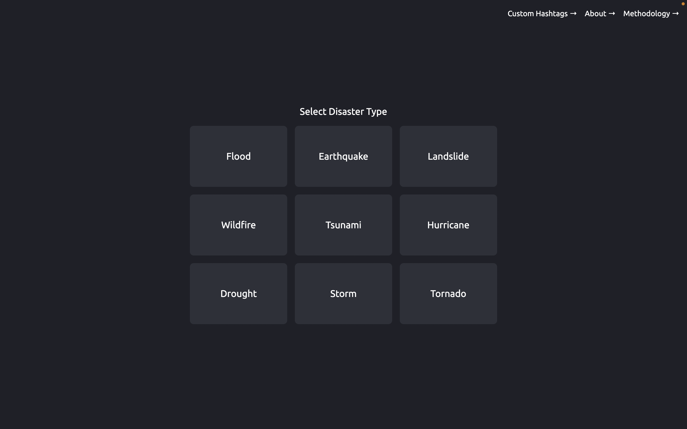
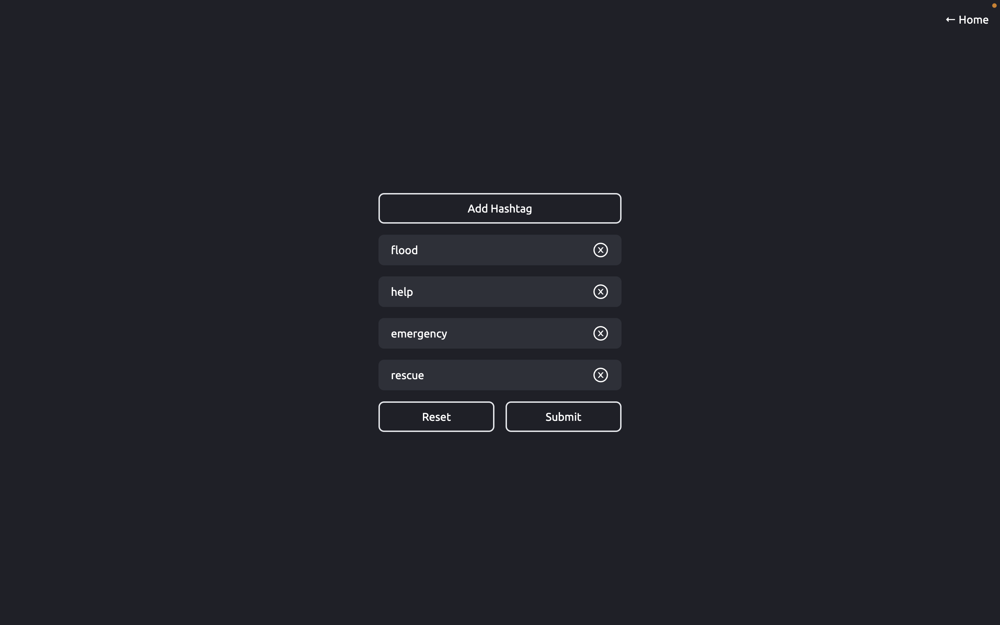
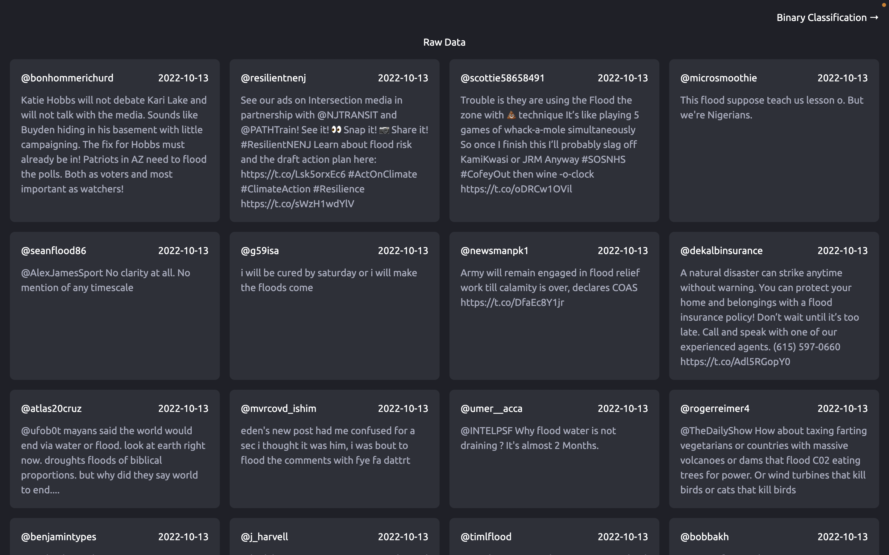
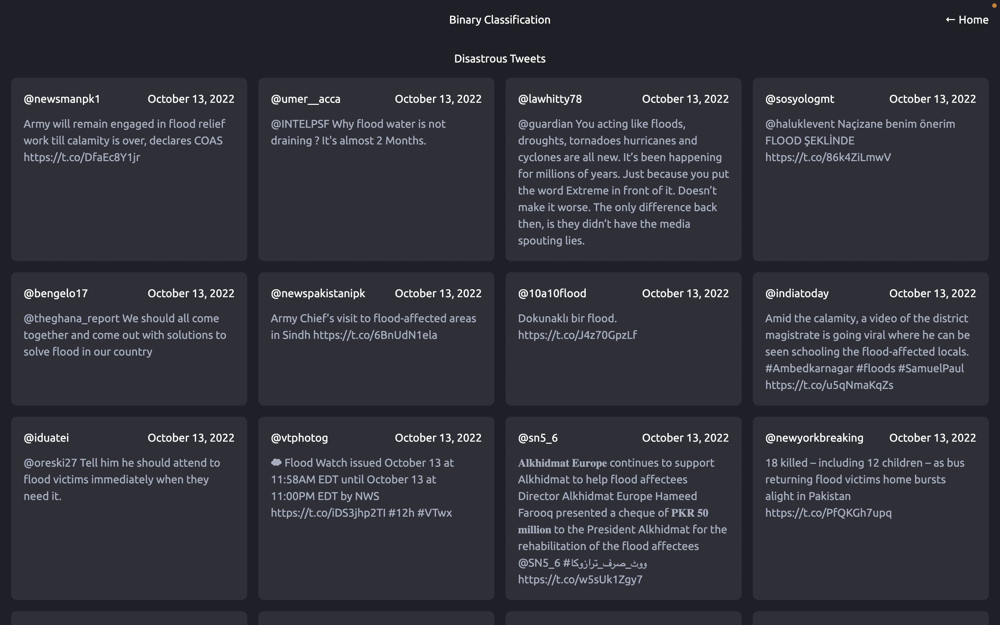
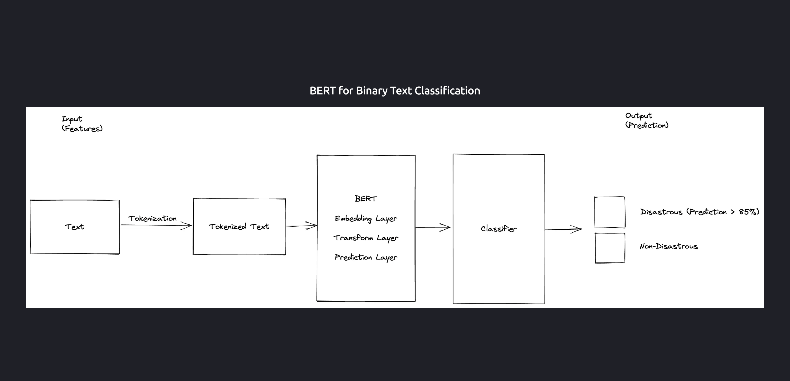

# Machine Learning Mini Project

## Undergrad CSE: Sem V

### Classification of Disaster related Tweets from Social Media

At the time of a disaster, many people ask for help through social media. They make tweets on Twitter asking for
immediate rescue. Extraction of raw data from social media like Twitter based on a few parameters like disaster type,
location, and disaster-related hashtags. The tweets extracted have noise - unwanted data which needs to be filtered out.
Our models would classify disaster-related tweets. These classified tweets can then be used to identify those people who
need help and using this information higher authorities can take quick actions.

---
Nodejs Version

> Node -v
> 16.15.1

### Tech Used

```
1. Next.js
2. Tailwind
3. Typescript
4. Axios
```

### Getting Started

---

First, install the required packages:

```
npm install
```

Then, configure the .env file:

```
Check the .env.example file
```

Then, run the development server:

```
npm run dev
```

---

### Sample Images

1. Select Disaster Type
   
2. Enter Custom Hashtags
   
3. Raw Data scraped from Twitter using Twint
   
4. Binary Classified Data using BERT Model
   
5. BERT model flow for Binary Classification of Text
   
